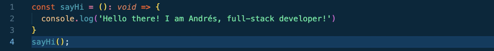

<!--  -->
<h2>Welcome to my GitHub profile ✌️</h2>

👋 Welcome! My name is Andrés. I am a software engineer and fintech professional based in Toronto and Berlin, well-versed in JavaScript and Python technologies. 
🧪 In a former life I was a chemical engineer, before making the leap to tech and finance.

Some of my favourite technologies are:

  

I cannot wait to get my hands on:
<a href="https://docs.soliditylang.org/en/v0.8.7/" display="inline-block">Solidity</a>  -  <a href="https://www.cplusplus.com/">C++</a>  -  <a href="https://www.java.com/">Java</a>

<h2>What am I up to these days?</h2>

👨‍💻 I am currently working on adding new features to AceOptions and refactoring to TypeScript.

👉 In case you want to know more about me, please check out my <a href="https://www.linkedin.com/in/andresolivez/">LinkedIn</a> profile.

📫 Feel free to reach out anytime at <a href="mailto:andresolive@gmail.com">andresolive@gmail.com</a>

